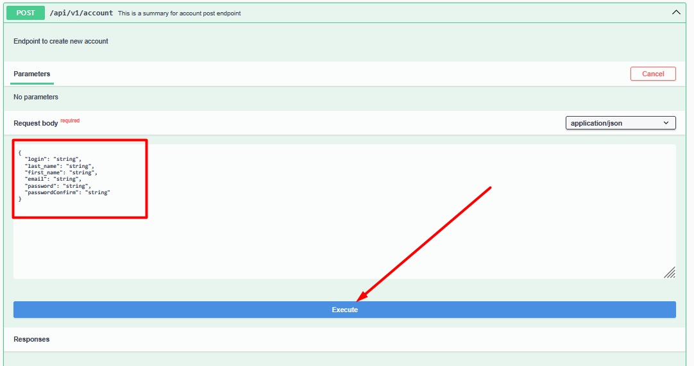
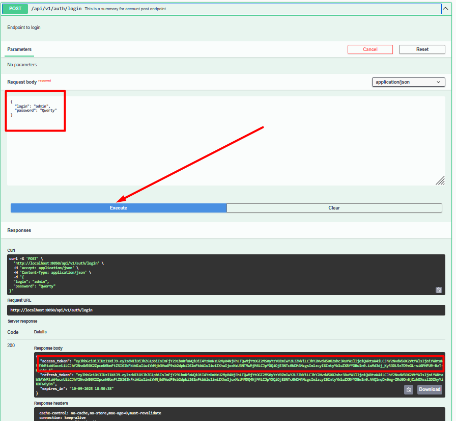
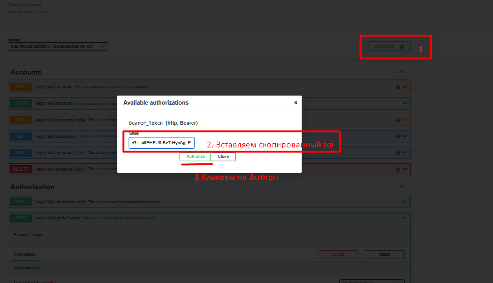
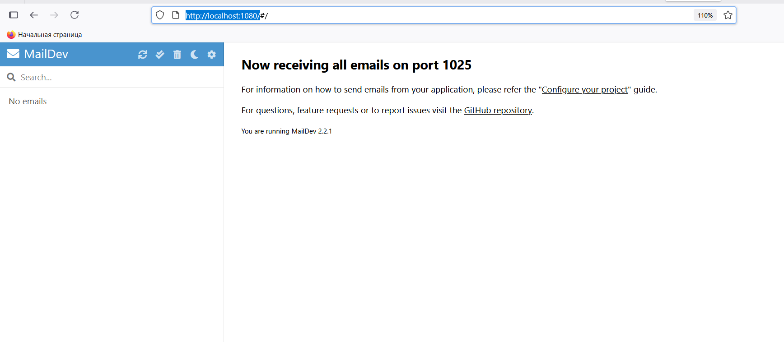
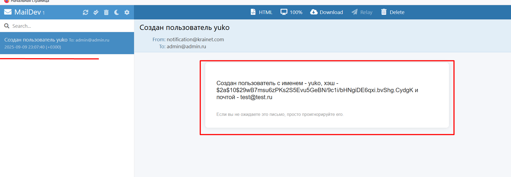

# krainet-app

#Запуск приложения 
1. Склонировать исходный код изветки main ветку
2. Запустить все сервисы через Docker Compose (docker-compose up -d --build)

#Дефолтные адреса микросервисов

| Сервис                   | URL                                            |
| ------------------------ | ---------------------------------------------- |
| **Auth API**             | [http://localhost:8050](http://localhost:8050) |
| **Notification API**     | [http://localhost:8040](http://localhost:8040) |
| **Configuration Server** | [http://localhost:8888](http://localhost:8888) |
| **Discovery (Eureka)**   | [http://localhost:8761](http://localhost:8761) |
| **PgAdmin**              | [http://localhost:5050](http://localhost:5050) |
| **MailDev (UI)**         | [http://localhost:1080](http://localhost:1080) |
| **MailDev (SMTP)**       | порт `1025`                                    |
| **Kafka**                | доступен на `localhost:9092`                   |

#Предустановленый пользователь с ролью "Admin"
```json { "login": "admin", "password": "Qwerty" } ```

#Описание ендпойнтов сервиса Auth API http://localhost:8050/swagger-ui/index.html#/

| Endpoint                 | Method| Description                             |
| ------------------------ | ------|---------------------------------------- |
| /api/v1/account          | PUT  | Доступен для авторизированных пользователей, обновление данных аккаунта|
| /api/v1/account          | POST | Доступен для всех, создание аккаунта (создается аккаунт с ролью "User")|
| /api/v1/account/role     | PUT  | Доступен для роли Admin, изменение роли для аккаунта (доступные роли "ADMIN","USER")|
| /api/v1/accounts         | GET  | Доступен для роли Admin, просмотр пагинированного списка аккаунтов|
| /api/v1/account/{id}     | GET  | Доступен для авторизированных пользователей, просмотр аккаунта (Для роли USER - имеет доступ только к своему аккаунту) |
| /api/v1/account/{id}     | DELETE | Доступен для авторизированных пользователей, удаление аккаунта (Для роли USER - имеет права на удаление только своего аккаунта |
| /api/v1/auth/refresh     | POST | Доступен для всех, обновление токена|
| /api/v1/auth/login       | POST | Доступен для всех, получение  токена|
| /api/v1/auth/logout      | GET | Доступен для авторизированных пользователей, деактивация токена|

# Процесс тестирования
### 1. Создайте новый аккаунт и авторизируйтесь или используйте данные предустановленного пользователя для авторизации:

\* Создание пользователя


\* Получение токена


\* Авторизация в swagger

### 2. Производим операции с аккаунтами создать/удалить/изменить;
### 3. Переходим http://localhost:1080/ (тестовый email сервер) и ждем прихода писем (процедура подготовки/отправки писем работает по планнирувщику - подготовка логов с auth сервиса каждые 5 секунд, отправка сообщений с notification сервиса каждые 5 секунд)

\* Почтовый сервис
### 4. Пример отправленных писем

\* Почтовый сервис